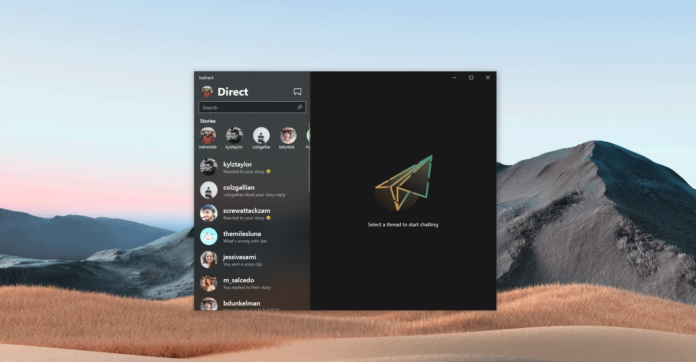

# Indirect
An unofficial UWP Instagram Direct Message client for Windows 10, built with the goal of providing Instagram messaging capability for Windows devices while maintaining Windows 10 design language.

## References
Some code used in this project is heavily referenced from the following sources:
- [InstaSharper](https://github.com/a-legotin/InstaSharper) by [a-legotin](https://github.com/a-legotin/)
- [InstagramApiSharp](https://github.com/ramtinak/InstagramApiSharp) by [ramtinak](https://github.com/ramtinak/)

## Legal
This project is in no way affiliated with, authorized, maintained, sponsored or endorsed by Instagram or any of its affiliates or subsidiaries.
